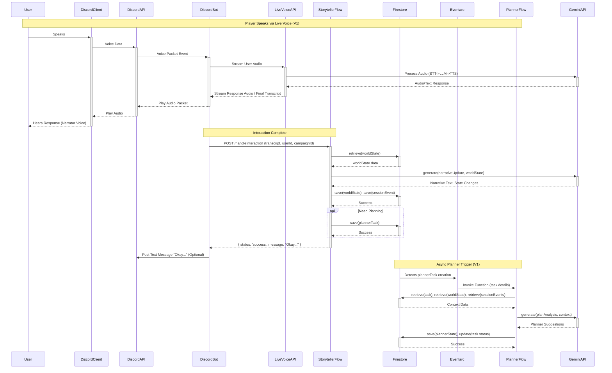

# Architecture & System Design Document: LLM-Powered TTRPG GM Agent (v2.0 - V1 Scope)
(Generated: YYYY-MM-DD)

**Table of Contents**
1. Introduction
2. Glossary
3. Architectural Goals & Principles
4. High-Level Architecture (C4 Model Views - V1 Scope)
5. Backend Architecture (Genkit Flows & Discord Bot - V1 Scope)
6. Data Model & Management (Firestore)
7. API Specifications (V1 Scope)
8. Interaction Flows & Sequence Diagrams (V1 Scope)
9. Deployment Architecture
10. Security Considerations
11. Monitoring, Logging, & Alerting Strategy (V1 Scope)
12. Scalability & Performance Considerations
13. Development Practices & Standards
14. **User Experience Design (V1 Scope)**
15. Future Considerations & Evolution Path
16. Appendices

## 1. Introduction

### 1.1. Purpose of this Document
This document details the **V1 technical architecture** and system design for the LLM-Powered Tabletop RPG GM Agent (v2.0), focusing on the initial feature set.

### 1.2. Project Goals & Objectives (Technical Focus - V1)
- Deliver a responsive voice (Narrator only) and text-based TTRPG experience.
- Leverage Genkit for AI flow orchestration and Firebase Studio for management.
- Utilize Google Cloud native services (CFn v2, Firestore, Eventarc, Gemini Models, Live Voice API).
- Ensure maintainability, scalability, and cost-effectiveness for the V1 feature set.
- Prioritize DX through clear structure and tooling.

### 1.3. Scope (V1 Features & Exclusions)
- **In Scope (V1):** Features defined in `product_requirements_v2.md` **marked for V1**, including real-time Narrator voice (using Live Voice API for all GM speech), text interaction, Gemini-powered logic (Storyteller/Planner), Firestore state management (via Genkit utils), rules-light system support, Discord integration.
- **Out of Scope (V1):** **Distinct NPC voices (via TTS tool), Image Generation (via DALL-E tool)**, Complex RPG systems, web UI, other advanced features listed in PRD v2 Section 12.

### 1.4. Target Audience
AI Engineers, Backend Developers, DevOps Engineers involved in the project.

### 1.5. Related Documents
- `docs/product_requirements_v2.md` (Defines V1 scope)
- `docs/STYLE_GUIDE.md` (To be created)
- Firebase Studio Documentation
- Genkit Documentation
- Google Live Voice API Documentation

## 2. Glossary
(Unchanged from previous V2 draft)

## 3. Architectural Goals & Principles
(Unchanged from previous V2 draft, but applied to the simplified V1 scope)

## 4. High-Level Architecture (C4 Model Views - V1 Scope)

### 4.1. System Context Diagram (Level 1 - V1 Scope)

*Removes `gcloudTtsTool`, `dalleTool` and their external API calls.* 

```mermaid
graph LR
    user[Player] -- Interacts via --> discordClient(Discord Client)
    discordClient -- Uses --> discordApi(Discord API)
    discordApi -- Events --> discordBot(Discord Bot
[Node.js/discord.js
Cloud Run])
    discordBot -- Streams Audio/Gets Transcript --> liveVoiceApi(Google Live Voice API
[Gemini])
    discordBot -- HTTPS POST (Interaction Results) --> storytellerFlow(Storyteller Flow
[Genkit/CFn v2])
    discordBot -- Receives Commands --> discordBot
    discordBot -- Posts Messages/Plays Audio --> discordApi
    storytellerFlow -- Calls --> geminiApi(Google Gemini API
[Native Genkit])
    storytellerFlow -- Reads/Writes State --> firestore(Firestore Database)
    firestore -- Write Events --> eventarc(Eventarc Trigger)
    eventarc -- Invokes --> plannerFlow(Planner Flow
[Genkit/CFn v2])
    plannerFlow -- Calls --> geminiApi
    plannerFlow -- Reads/Writes State --> firestore
    admin[Developer/Admin] -- Manages/Monitors --> firebaseStudio(Firebase Studio)
    firebaseStudio -- Deploys/Manages --> storytellerFlow
    firebaseStudio -- Deploys/Manages --> plannerFlow
    firebaseStudio -- Views --> firestore
    firebaseStudio -- Views --> cloudLogging(Cloud Logging/Monitoring)
    storytellerFlow -- Logs --> cloudLogging
    plannerFlow -- Logs --> cloudLogging
    discordBot -- Logs --> cloudLogging
```

### 4.2. Container Diagram (Level 2 - V1 Scope)

*Removes `gcloudTtsApi`, `openaiApi` external APIs and the "Custom Genkit Tools" subgraph.* 

```mermaid
graph TD
    subgraph "Internet"
        user[Player]
    end

    subgraph "Discord Platform"
        discordClient(Discord Client)
        discordApi(Discord API)
    end

    subgraph "Google Cloud Project"
        subgraph "Client Application (Cloud Run)"
            discordBot(Discord Bot
[Node.js/discord.js]
Handles Discord API Events, Live Voice API streaming, Calls Storyteller Flow)
        end

        subgraph "Backend Genkit Flows (Cloud Functions v2)"
            storytellerFlow(Storyteller Flow
[Genkit - TS]
Handles interaction logic, Gemini calls, state updates)
            plannerFlow(Planner Flow
[Genkit - TS]
Handles async analysis, planning)
        end

        subgraph "External AI APIs (V1)"
            liveVoiceApi(Google Live Voice API
[Managed Service])
            geminiApi(Google Gemini API
[Managed Service])
        end

        subgraph "Data & Events"
            firestore(Firestore Database
[Managed Service])
            eventarc(Eventarc
[Managed Service]
Listens to Firestore, triggers Planner)
        end

        subgraph "Management & Monitoring"
            firebaseStudio(Firebase Studio
[Management UI])
            cloudLogging(Cloud Logging/Monitoring
[Managed Service])
            secretManager(Secret Manager
[Managed Service])
        end
    end

    user -- Voice/Text --> discordClient
    discordClient -- Interaction --> discordApi
    discordApi -- Events --> discordBot
    discordBot -- Streams Audio/Receives Results --> liveVoiceApi
    discordBot -- Makes API Calls --> storytellerFlow
    discordBot -- Manages Secrets --> secretManager
    storytellerFlow -- Calls --> geminiApi
    storytellerFlow -- Reads/Writes --> firestore
    storytellerFlow -- Logs --> cloudLogging
    storytellerFlow -- Manages Secrets --> secretManager
    firestore -- Triggers --> eventarc
    eventarc -- Invokes --> plannerFlow
    plannerFlow -- Calls --> geminiApi
    plannerFlow -- Reads/Writes --> firestore
    plannerFlow -- Logs --> cloudLogging
    plannerFlow -- Manages Secrets --> secretManager
```

## 5. Backend Architecture (Genkit Flows & Discord Bot - V1 Scope)

### 5.1. Language/Runtime
(Unchanged: Node.js/TypeScript for Flows & Bot)

### 5.2. Framework Choice
(Unchanged: Genkit, discord.js)

### 5.3. API Style
- Bot -> Storyteller Flow: RESTful HTTPS POST.
- Flow -> **External APIs (V1):** RESTful HTTPS (Gemini via native Genkit).
- Flow <-> Firestore: Native Genkit Firestore utils.
- Bot <-> Live Voice API: Bidirectional streaming.

### 5.4. Compute Platform
(Unchanged: CFn v2 for Flows, Cloud Run for Bot)

### 5.5. Database Choice
(Unchanged: Firestore)

### 5.6. ORM/Database Client
(Unchanged: Prioritize Genkit Firestore utils)

### 5.7. Authentication Strategy
- Bot -> Storyteller Flow: GCP Identity Token.
- Flows -> Google Cloud APIs (Gemini, Firestore): Runtime SA identity.
- **Flows -> External APIs (V1): No external non-Google APIs requiring separate keys.**

### 5.8. Modularity/Service Structure
- **Genkit Flows:** `storyteller.flow.ts`, `planner.flow.ts`.
- **Genkit Tools:** **None required for V1.**
- **Discord Bot:** Modular structure (`bot.ts`, `commandHandler.ts`, `liveVoiceHandler.ts`).
- **Shared Utilities:** `src/utils/`, `src/config/`, `src/data/schemas.ts`.

### 5.9. Key Libraries & Tools (V1)
- **Genkit:** `@genkit-ai/core`, `@genkit-ai/firebase`, `@genkit-ai/googleai`.
- **Discord Bot:** `discord.js`, `axios`/`node-fetch`, Google Auth Library.
- **Tools:** **No external tool SDKs (TTS, OpenAI) needed for V1.**
- **General:** TypeScript, ESLint, Prettier, Jest/Vitest.
- **Infrastructure:** Terraform.

## 6. Data Model & Management (Firestore)
(Unchanged from previous V2 draft)

## 7. API Specifications (V1 Scope)

### 7.1. Backend API Contract (Storyteller Flow Endpoint)
(Unchanged request format, but response body simplifies)
- **Response Body (V1):** JSON payload, likely just `{ status: 'success' | 'error', message?: string }`. **No `npcAudioUrl` or `imageUrl` needed.** Output validated using Zod schema.

### 7.2. External API Usage Contracts (V1)
- **Google Live Voice API:** (As before)
- **Google Gemini API:** (As before)
- **Google Cloud TTS API: (Deferred Post-V1)**
- **OpenAI DALL-E API: (Deferred Post-V1)**

## 8. Interaction Flows & Sequence Diagrams (V1 Scope)
(Refer to PRD v2 Section 8, V1 Scope. Sequence diagrams simplified).



## 9. Deployment Architecture
(Unchanged from previous V2 draft, as core infra remains the same)

## 10. Security Considerations
(Largely unchanged, but simpler as fewer external APIs reduce attack surface slightly. OpenAI key management is not needed for V1).

## 11. Monitoring, Logging, & Alerting Strategy (V1 Scope)
(Largely unchanged, but remove alerts/metrics related to deferred TTS/DALL-E APIs).
- Focus monitoring on Live Voice API, Gemini API, Flows, Bot, Firestore.

## 12. Scalability & Performance Considerations
(Unchanged core strategy, but simpler flows in V1 may have slightly better baseline performance).

## 13. Development Practices & Standards
(Unchanged practices, but testing scope reduced as no custom tools needed for V1).

## 14. User Experience Design (V1 Scope)

### 14.1 Core Principles

1.  **Effortless Interaction:** Prioritize natural language via the Live Voice API. Minimize the need for players to learn specific commands or interaction protocols.
2.  **Clarity & Feedback:** Players should have a clear understanding of the game state, whose turn it is (implicitly), and whether the GM has understood them, without cluttering the interface.
3.  **Voice First:** The primary interaction modality is voice. Text serves as a record, an alternative for specific commands, and a channel for non-verbal GM communication (like status updates or errors).
4.  **Immersion:** Technical feedback (errors, status) should be minimal, non-intrusive, and phrased appropriately to avoid breaking the narrative spell where possible.

### 14.2 Player Discord Interaction (V1)

#### 14.2.1 Voice Interaction (Live Voice API)

*   **Initiation & Presence:**
    *   When the Bot joins the voice channel, it should remain silent initially or provide a very brief, one-time audio cue like *"GM is ready."* to signal its presence.
    *   *Opinion:* Avoid repetitive "I'm listening" announcements. Presence should be implicit.
*   **Turn Management & Flow:**
    *   We rely heavily on the natural turn-taking facilitated by the **Google Live Voice API's VAD (Voice Activity Detection) and endpointing**. The GM speaks its turn, and the subsequent silence implies it's ready for player input.
    *   *Opinion:* **No explicit "Your turn" prompts.** This feels artificial. Players should speak when the GM finishes. If there's a long pause suggesting players are stuck, *then* the Storyteller flow can generate a prompt (e.g., "What do you do next?").
*   **GM Status Indication:**
    *   **Listening:** This is the default state when the Bot isn't speaking. No specific indicator is needed unless usability testing proves otherwise.
    *   **Thinking/Processing:** If the Storyteller flow requires significant processing time (> ~2-3 seconds) after the Live Voice API interaction concludes (i.e., after the player finishes speaking but before the GM replies), the Bot MUST post a *temporary* and *subtle* text message in the channel: `GM is pondering...` or `Thinking...`. This message should ideally be automatically deleted or updated once the GM starts speaking. *Opinion:* This feedback is crucial to prevent players from feeling ignored or wondering if the bot crashed, but it must be unobtrusive.
    *   **Speaking:** Clearly indicated by the Bot playing audio via the Live Voice API. Discord's native "speaking" indicator for the bot user helps here.
*   **Interruptions:**
    *   The Google Live Voice API likely has mechanisms for handling barge-in. We will rely on this behavior. If a player speaking interrupts the GM's output stream, the Bot will simply start processing the *new* player input stream provided by the API.
    *   *Opinion:* We will **not** build complex custom interruption logic (e.g., trying to pause/resume the GM's speech) in V1. Keep it simple; the API manages the audio stream turn-taking.
*   **NPC Dialogue (V1):**
    *   Since distinct voices are deferred, when an NPC speaks, the Narrator voice (via Live Voice API) will deliver the dialogue.
    *   *Opinion:* The Storyteller flow MUST clearly signal who is speaking in the generated text (fed to the Live Voice API), e.g., *"The old man squints and says, 'Well now, what brings you here?'"* The voice will be the narrator's, but the text attribution is key.

#### 14.2.2 Text Interaction

*   **Primary Use Cases:**
    *   Executing slash commands (`/roll`, `/reset`).
    *   Asking brief OOC (Out-of-Character) questions.
    *   Fallback if voice interaction fails.
    *   GM delivering detailed text blocks (e.g., item descriptions, lengthy location details) where voice might be inefficient.
*   **Transcripts:**
    *   The Discord Bot **MUST** post the final, confirmed transcript from the Live Voice API interaction into the text channel.
    *   *Opinion:* This should happen *after* the GM's corresponding voice response finishes playing to serve as a clean record without distracting during the audio response. This ensures accessibility and provides a searchable log.

#### 14.2.3 Slash Commands

*   `/roll [dice notation]` (e.g., `/roll 2d6+1`):
    *   **Feedback:** Instantaneous text response from the Bot: `PlayerName rolled 2d6+1: Result = 9`.
    *   *Opinion:* Keep it purely mechanical. The Storyteller flow handles the *narrative* consequence later via voice/text.
*   `/reset`:
    *   **Feedback:** Instantaneous, clear text confirmation: `System: State reset initiated. Please wait a moment.` followed by `System: State reset complete.` once confirmed by the backend.
    *   *Opinion:* Make it obvious this is a system-level action.

#### 14.2.4 Error Handling (Player-Facing)

*   **Live Voice API Issues (Hearing/Speaking):** Bot posts a clear, empathetic text message: `GM: "Apologies, I seem to be having trouble with the connection. Could you try speaking again, or use text?"`
*   **Storyteller/Planner Flow Error:** Bot posts a generic, in-character (if possible) text message: `GM: "Hmm, I lost my train of thought there. Could you tell me what you were doing again?"` Detailed technical errors are logged backend only. *Opinion:* Maintain immersion even during errors where possible.
*   **Command Error (e.g., bad `/roll` syntax):** Instant text feedback: `System: Invalid format for /roll. Please use standard dice notation (e.g., /roll 1d20, /roll 3d6+2).`

#### 14.2.5 Onboarding

*   When the Bot joins a channel/campaign for the first time, it posts a single welcome message including:
    *   Brief intro of the GM persona.
    *   Core interaction guide: *"Speak naturally when I'm quiet. Use `/roll` for dice checks. Let the adventure begin!"*
    *   *Opinion:* Keep it extremely short and focused on the absolute essentials.

### 14.3 Admin/GM Experience (V1 Observability)

*   **Planner Output:**
    *   The `planner_state` document in Firestore is the primary output view.
    *   *Design:* This document should be structured with clear top-level keys for different types of analysis (e.g., `plot_vectors`, `npc_status`, `potential_consequences`, `player_knowledge_gaps`) and include timestamps for when analyses were last updated. Use nested maps/arrays logically.
*   **Monitoring:**
    *   Directly view the `planner_state` document and `session_log`/`events` subcollection within the **Firebase Studio Firestore data viewer**. This is the main V1 interface for observing Planner activity.
*   **Logging:**
    *   Both Storyteller and Planner flows must log key events (inputs received, decisions made, data read/written, Gemini prompts/responses) to Cloud Logging using structured JSON.
    *   *Design:* Logs **MUST** include `campaignId` and ideally `sessionId` or `turnId` to easily filter and correlate events. Genkit traces should be used to link related operations. These logs are viewable in Firebase Studio / Cloud Logging.
*   **Setup/Control:**
    *   Initial Planner task triggered by the campaign setup script writing to the `plannerTasks` subcollection.
    *   *Opinion:* No direct admin commands to interact with or re-run the Planner in V1. Observation only.

## 15. Future Considerations & Evolution Path
(Renumbered - Previously 14)
(Reinforce that TTS/DALL-E tools are primary planned additions post-V1).
- **V-Next:** Implement distinct NPC voices (`gcloudTtsTool`), Implement Visuals (`dalleTool` or Imagen). 

## 16. Appendices
(Renumbered - Previously 15)
(TBD)
